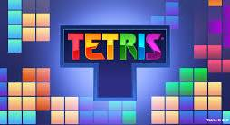

# Tetris

A classic Tetris clone built with Python and [pygame](https://www.pygame.org/), featuring a retro-arcade neon theme, a home screen, pause menu, game-over screen, and a persistent high score.

## Features

- Falling tetrominoes with all 7 classic shapes (I, O, T, S, Z, J, L)
- Movement, rotation, soft drop, and hard drop
- Line clearing with classic scoring (single/double/triple/Tetris)
- Persistent high score, saved to disk between sessions
- Home screen, pause menu (with clickable pause button), and game-over screen with restart
- Retro arcade visual theme (neon outlines, dark background)

## Controls

| Key         | Action              |
|-------------|---------------------|
| Left / Right | Move piece          |
| Up          | Rotate piece         |
| Down        | Soft drop            |
| Space       | Hard drop            |
| Esc         | Quit game             |
| P / Pause button | Pause / Resume  |

## Setup

1. Install dependencies:
   ```bash
   pip install pygame
   ```
2. Add a copy of the **Press Start 2P** font (`.ttf`) to `game/assets/PressStart2P-Regular.ttf`. This is used for the title and in-game text. It's free on [Google Fonts](https://fonts.google.com/specimen/Press+Start+2P).
3. Run the game:
   ```bash
   cd game
   python3 main.py
   ```

## Project structure

```
Tetris/
├── README.md
└── game/
    ├── main.py            # entry point: window, game loop, input, drawing
    ├── matrix.py           # board state, gravity, collision, locking, line clears
    ├── pieces.py            # tetromino shapes, rotations, colors
    ├── score.py             # score tracking + persistent high score
    ├── buttons.py            # clickable button rectangles
    ├── config.py              # screen size, colors/theme, fonts, file paths
    ├── menus_config.py         # pre-rendered text for Home/Pause/Game Over screens
    ├── assets/                  # fonts (not included — see Setup)
    └── src/
        └── scores               # saved high score (created automatically)
```

## How it works

- **Board** — represented as a 2D grid (`matrix.py`), where each cell is either `None` (empty) or a piece-kind letter (e.g. `"T"`).
- **Falling piece** — tracked separately from the locked grid until it can no longer move down, at which point it's written into the grid ("locked") and a new piece spawns.
- **Piece randomness** — pieces are chosen randomly from the 7 tetromino kinds each time a new piece spawns.
- **Collision detection** — every move, rotation, and drop is checked against the board edges and locked cells before being applied.
- **Line clearing** — after locking a piece, any completely full rows are removed and empty rows are inserted at the top, with points awarded based on how many lines cleared at once.
- **Game over** — triggered when a newly spawned piece immediately overlaps existing locked blocks (no room left at the top).
- **High score** — saved to `game/src/scores` whenever a new high score is reached, and loaded back in automatically when the game starts.

## Possible future additions

- Next-piece preview panel
- Level speed-up as more lines are cleared

## Send Some Feedback!

You can fill out the feedback form down below (optional):

[Feedback!](https://docs.google.com/forms/d/e/1FAIpQLSelBysP5_qbqVjGGKf_AtpzXo7QB64P6m0B2amrUfsUHl7BzQ/viewform?usp=publish-editor)
